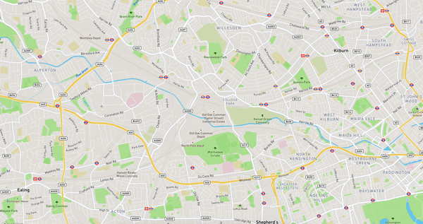
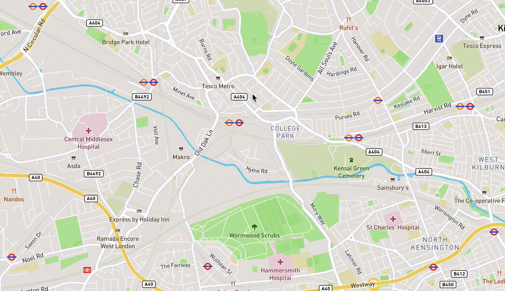

# mapbox-gl-draw-circle

This package was forked from [mapbox-gl-draw-circle](https://github.com/iamanvesh/mapbox-gl-draw-circle). We originally reached out to @iamanvesh about working together and received no response but are still open to doing so moving forward!

Adds support for drawing and editing a circle feature using [mapbox-gl-draw](https://github.com/mapbox/mapbox-gl-draw) library.

## Demo

##### Circle mode



##### Drag Circle mode



## Usage

### Installation

```
npm install maplibre-gl-draw-circle
```

```
import {
    CircleMode,
    DragCircleMode,
    DirectMode,
    SimpleSelectMode
} from 'maplibre-gl-draw-circle';


// userProperties has to be enabled
const draw = new MapboxDraw({
  defaultMode: "draw_circle",
  userProperties: true,
  modes: {
    ...MapboxDraw.modes,
    draw_circle  : CircleMode,
    drag_circle  : DragCircleMode,
    direct_select: DirectMode,
    simple_select: SimpleSelectMode
  }
});

// Add this draw object to the map when map loads
map.addControl(draw);
```

The default radius units are in **kilometers** and initial radius is **2km**.

```
// Provide the default radius as an option to CircleMode
draw.changeMode('draw_circle', { initialRadiusInKm: 0.5 });
```

It fires the same events as the mapbox-gl-draw library. For more information follow this [link](https://github.com/mapbox/mapbox-gl-draw/blob/master/docs/API.md#events).

Sample feature object returned in `draw.create` event

```
{
  "id": "e184898e58feaa5c2c56f20a178ffe2c",
  "type": "Feature",
  "properties": {
    "isCircle": true,
    "center": [
      -0.2472604947478203,
      51.53200220026099
    ],
    "radiusInKm": 2
  },
  "geometry": {
    "coordinates": [], // populated with 64 vertices used to render the circle
    "type": "Polygon"
  }
}
```

## Changelog

### v1.1.0

- Added a new DragCircle mode.
- Fixed issue (#5), where the polygon mode was not working when used along with CircleMode.
